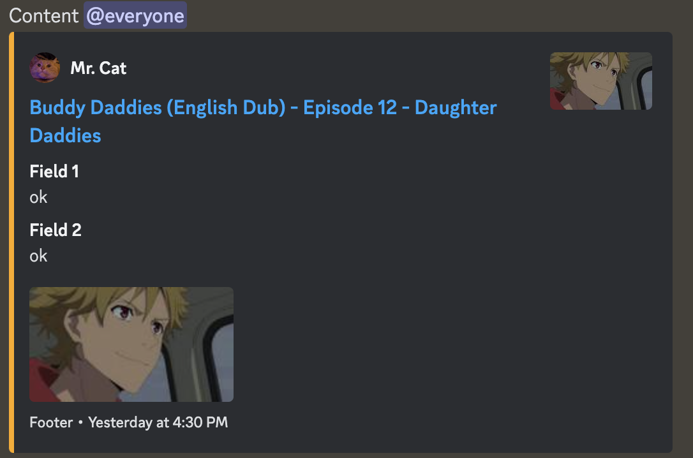
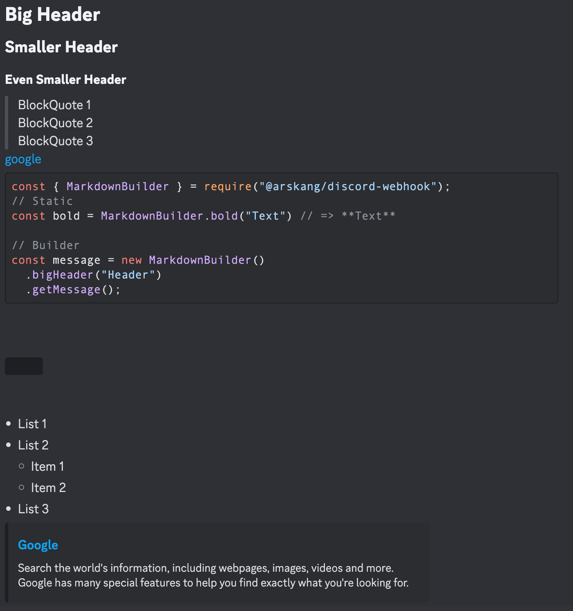

# Discord Webhook

Library to use Discord webhooks

#### Structure
- **[**Discord Webhooks Guide](https://birdie0.github.io/discord-webhooks-guide/discord_webhook.html)

#### Install
```bash
yarn add @arskang/discord-webhook

npm install @arskang/discord-webhook
```

#### Types

- **DiscordMessage**
  - **username**?: string; __*/ Max 80 /*__ ```new```
  - **avatar_url**?: string; ```new```
  - **content**?: string __*/ Max 2000 /*__
  - **embeds**?: Embed[] __*/ Max 10 /*__
  - **attachments**?: DiscordFile[] __*/ Max 10 /*__ ```updated```
  - **tts**?: TTS
  - **allowed_mentions**?: AllowedMentions
- **Embed**
  - **title**?: string __*/ Max 256 /*__
  - **description**?: string __*/ Max 2048 /*__ ```updated```
  - **url**?: string
  - **color**?: number
  - **fields**?: Field[] __*/ Max 25 /*__
  - **author**?: Author
  - **footer**?: Footer
  - **image**?: Image
  - **thumbnail**?: Image
- **Author**
  - **name**?: string __*/ Max 256 /*__
  - **url**?: string
  - **icon_url**?: string
- **Field**
  - **name**: string __*/ Max 256 /*__
  - **value**: string __*/ Max 1024 /*__
  - **inline**?: boolean
- **Footer**
  - **text**?: string __*/ Max 2048 /*__
  - **icon_url**?: string
  - **timestamp**?: string __*/ ISO string /*__
- **Image**
  - **url**: string
- **TTS**
  - **content**: string
  - **tts**: boolean
- **AllowedMentions**
  - **parse**?: Parse[] __*/ everyone, users o roles /*__
  - **users**?: string[]
  - **roles**?: string[]
- **WebhookSettings** ```new```
  - **username**?: string __*/ Max 80 /*__ ```new```
  - **avatar_url**?: string ```new```
- **DiscordFile** ```new```
  - **data**: fs.ReadStream ```new```
  - **name**: string ```new```
- **Parse** (*enum*): everyone, users o roles

#### EmbedBuilder

##### Methods:

- **setTitle**(title: string = ''): *return this*
- **setDescription**(description: string = ''): *return this*
- **setUrl**(url: string = ''): *return this*
- **setColor**(hexColor: string = ''): *return this*
- **addField**(field: Field): *return this*
- **setAuthor**(author: Author = {}): *return this*
- **setFooter**(footer: Footer = {}): *return this*
- **setImage**(url?: string, isAttachmentfile?: boolean): *return this* ```updated```
- **setThumbnail**(url?: string, isAttachmentfile?: boolean): *return this* ```updated```
- **getJson**(): return json string
- **build**(): return **Embed**

##### Example:

```js
const { EmbedBuilder } = require("@arskang/discord-webhook");

const embed = new EmbedBuilder()
  .setTitle("Buddy Daddies (English Dub) - Episode 12 - Daughter Daddies")
  .setColor("#fea800") // Hexadecimal
  .setImage("https://img1.ak.crunchyroll.com/i/spire3-tmb/34be63a102d3e6947dfbcc477d99074f1681503912_thumb.jpg")
  .setThumbnail("https://img1.ak.crunchyroll.com/i/spire3-tmb/34be63a102d3e6947dfbcc477d99074f1681503912_thumb.jpg")
  .setUrl("http://www.crunchyroll.com/buddy-daddies/episode-12-daughter-daddies-896284")
  .setAuthor({
    name: "Mr. Cat",
    url: "https://www.reddit.com/r/cats/",
    icon_url: "https://i.imgur.com/R66g1Pe.jpg"
  })
  .setFooter({
    text: "Footer",
    timestamp: "2023-04-14T21:30:00.000Z",
  })
  .addField({ name: "Field 1", value: "ok" })
  .addField({ name: "Field 2", value: "ok" });

// Get json string
console.log(embed.getJson());
// {
//   "title": "Buddy Daddies (English Dub) - Episode 12 - Daughter Daddies",
//   "color": 16689152,
//   "image": {
//     "url": "https://img1.ak.crunchyroll.com/i/spire3-tmb/34be63a102d3e6947dfbcc477d99074f1681503912_thumb.jpg"
//   },
//   "thumbnail": {
//     "url": "https://img1.ak.crunchyroll.com/i/spire3-tmb/34be63a102d3e6947dfbcc477d99074f1681503912_thumb.jpg"
//   },
//   "url": "http://www.crunchyroll.com/buddy-daddies/episode-12-daughter-daddies-896284",
//   "author": {
//     "name": "Mr. Cat",
//     "url": "https://www.reddit.com/r/cats/",
//     "icon_url": "https://i.imgur.com/R66g1Pe.jpg"
//   },
//   "footer": {
//     "text": "Footer"
//   },
//   "timestamp": "2023-04-14T21:30:00.000Z",
//   "fields": [
//     {
//       "name": "Field 1",
//       "value": "ok"
//     },
//     {
//       "name": "Field 2",
//       "value": "ok"
//     }
//   ]
// }
```

#### MessageBuilder

##### Methods:

- **overrideWebhook**(settings: WebhookSettings = {}'): *return this* ```new```
- **setContent**(content: string = ''): *return this*
- **addAttachment**(attachment?: DiscordFile): *return this* ```updated```
- **addEmbed**(embed?: Embed): *return this*
- **setTTS**(content?: string): *return this*
- **setAllowedMentionsParse**(parse?: Parse[]): *return this*
- **setAllowedMentionsUsers**(users?: string[]): *return this*
- **setAllowedMentionsRoles**(roles?: string[]): *return this*
- **getJson**(): return json string
- **build**(): return **DiscordMessage**

##### Example:

```js
const { MessageBuilder } = require("@arskang/discord-webhook");

const message = new MessageBuilder()
  .setContent("Content @everyone")
  .setAllowedMentionsParse(["everyone"])
  .addEmbed(embed.build());

// Get json string
console.log(message.getJson());
// {
//   "content": "Content @everyone",
//   "allowed_mentions": { "parse": ["everyone"] },
//   "embeds": [
//     {
//       "title": "Buddy Daddies (English Dub) - Episode 12 - Daughter Daddies",
//       "color": 16689152,
//       "image": {
//         "url": "https://img1.ak.crunchyroll.com/i/spire3-tmb/34be63a102d3e6947dfbcc477d99074f1681503912_thumb.jpg"
//       },
//       "thumbnail": {
//         "url": "https://img1.ak.crunchyroll.com/i/spire3-tmb/34be63a102d3e6947dfbcc477d99074f1681503912_thumb.jpg"
//       },
//       "url": "http://www.crunchyroll.com/buddy-daddies/episode-12-daughter-daddies-896284",
//       "author": {
//         "name": "Mr. Cat",
//         "url": "https://www.reddit.com/r/cats/",
//         "icon_url": "https://i.imgur.com/R66g1Pe.jpg"
//       },
//       "footer": {
//         "text": "Footer"
//       },
//       "timestamp": "2023-04-14T21:30:00.000Z",
//       "fields": [
//         {
//           "name": "Field 1",
//           "value": "ok"
//         },
//         {
//           "name": "Field 2",
//           "value": "ok"
//         }
//       ]
//     },
//   ]
// }
```

##### Attachments example:

```js
const fs = require("fs")
const path = require("path")
const { EmbedBuilder, MessageBuilder } = require("@arskang/discord-webhook");

const imageName = "imagen.jpg"
const image = fs.createReadStream(path.join(__dirname, "DIR"))

const embed = new EmbedBuilder()
  .setTitle("Title")
  .setImage(imageName, true) // isAttachmentfile
  .setThumbnail(imageName, true); // isAttachmentfile

new MessageBuilder()
  .addAttachment({ name: imageName, data: image })
  .setContent("Content");
```

#### HookBuilder

##### Methods:

- **constructor**(url: string): *return this*
- **addMessage**(message: DiscordMessage): *return this*
- **send**(): return **axios (array) response promise**

##### Example:

- Javascript
```js
const { HookBuilder } = require("@arskang/discord-webhook");

// axios (array) response promise
try {
  const hook = new HookBuilder("DISCORD_WEBHOOK_URL");

  const allResponse = await hook
    .addMessage(message.build())
    .send();

  allResponse.forEach(({ data }) => console.log(data));
} catch({ message }) {
  console.error(message);
}
```

##### Output:



#### MarkdownBuilder

- **bold**(text: string): **return this**
  - **(static) bold**(text: string): *string*
- **italic**(text: string): *return this*
  - **(static) italic**(text: string): *string*
- **underline**(text: string): *return this*
  - **(static) underline**(text: string): *string*
- **strikethrough**(text: string): *return this*
  - **(static) strikethrough**(text: string): *string*
- **bigHeader**(text: string): *return this*
  - **(static) bigHeader**(text: string): *string*
- **smallerHeader**(text: string): *return this*
  - **(static) smallerHeader**(text: string): *string*
- **evenSmallerHeader**(text: string): *return this*
  - **(static) evenSmallerHeader**(text: string): *string*
- **links**(name: string, url: string): *return this*
  - **(static) links**(name: string, url: string): *string*
- **list**(list: MarkdownList = []): *return this*
  - **(static) list**(list: MarkdownList = []): *string*
- **codeBlocks**(text: string, language?: string) *return this*
  - **(static) codeBlocks**(text: string, language?: string): *string* 
- **inlineBlockQuote**(text: string): *return this*
  - **(static) inlineBlockQuote**(text: string): *string*
- **blockQuotes**(text: string): *return this*
  - **(static) blockQuotes**(text: string): *string*
- **spoiler**(text: string): *return this*
  - **(static) spoiler**(text: string): *string*
- **channelTag**(id: string): *return this* ```new```
  - **(static) channelTag**(id: string): *string* ```new```
- **uroleTag**(id: string): *return this* ```new```
  - **(static) uroleTag**(id: string): *string* ```new```
- **lineBreak**(): *return this*
- **getMessage**(): return string message

##### Example:

- Javascript
```js
  const { MarkdownBuilder } = require("@arskang/discord-webhook");

  // Static
  // => **Bold**
  MarkdownBuilder.bold("Bold")
  // => *Italic*
  MarkdownBuilder.italic("Italic")
  // => __Underline__
  MarkdownBuilder.underline("Underline")
  // => ~~Strike Thorugh~~
  MarkdownBuilder.strikethrough("Strike Thorugh")
  // => # Big Header
  MarkdownBuilder.bigHeader("Big Header")
  // => ## Smaller Header
  MarkdownBuilder.smallerHeader("Smaller Header")
  // => ### Even Smaller Header
  MarkdownBuilder.evenSmallerHeader("Even Smaller Header")

  // Builder
  const messageMarkdown = new MarkdownBuilder()
    .bigHeader("Big Header")
    .smallerHeader("Smaller Header")
    .evenSmallerHeader("Even Smaller Header")
    .inlineBlockQuote("BlockQuote 1")
    .inlineBlockQuote("BlockQuote 2")
    .inlineBlockQuote("BlockQuote 3")
    .links("google", "https://www.google.com")
    .codeBlocks(`
const { MarkdownBuilder } = require("@arskang/discord-webhook");
// Static
const bold = MarkdownBuilder.bold("Text") // => **Text**

// Builder
const message = new MarkdownBuilder()
  .bigHeader("Header")
  .getMessage();`, 'js')
    .lineBreak()
    .spoiler('spoiler')
    .lineBreak()
    .list([
      "List 1",
      {
        name: "List 2",
        items: ["Item 1", "Item 2"],
      },
      "List 3"
    ])
    .getMessage();

  console.log(message)
  // # Big Header
  // ## Smaller Header
  // ### Even Smaller Header
  // > BlockQuote 1
  // > BlockQuote 2
  // > BlockQuote 3
  // [google](https://www.google.com)
  // ```js

  // const { MarkdownBuilder } = require("@arskang/discord-webhook");
  // // Static
  // const bold = MarkdownBuilder.bold("Text") // => **Text**

  // // Builder
  // const message = new MarkdownBuilder()
  //   .bigHeader("Header")
  //   .getMessage();
  // ```


  // ||spoiler||


  // - List 1
  // - List 2
  //   - Item 1
  //   - Item 2
  // - List 3
```

##### Output:


